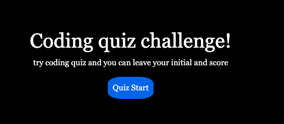
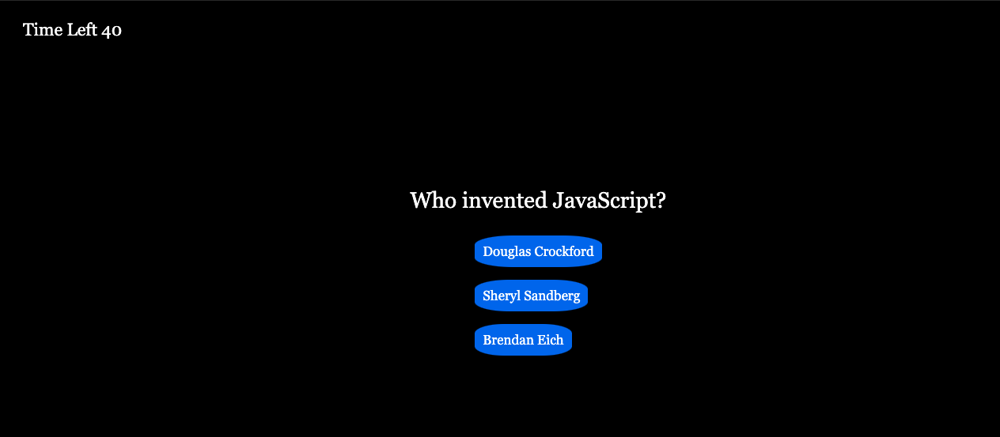
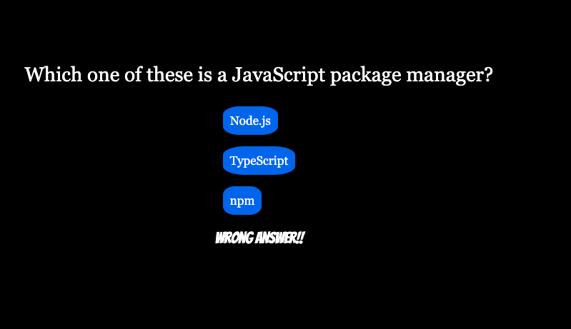
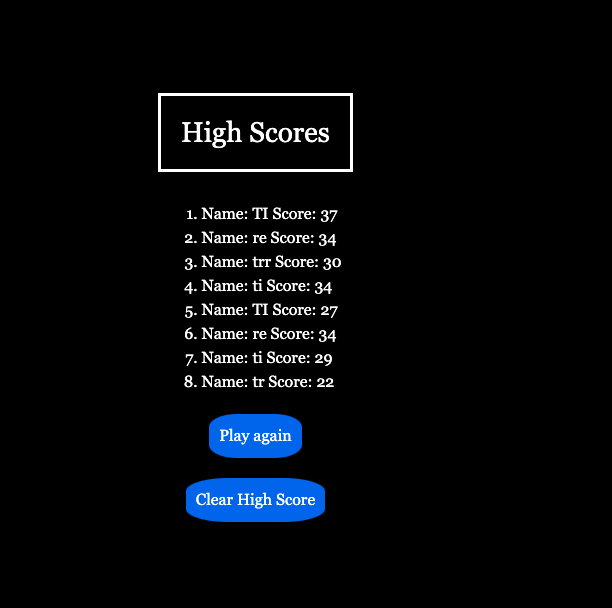

# Fun_CodeQuiz
Homework_Week4

# Assignment Criteria
 * WHEN I click the start button

  

 * THEN a timer starts and I am presented with a question
  

 * WHEN I answer a question
 

 * WHEN all questions are answered or the timer reaches 0
 THEN the game is over
 * THEN I can save my initials and score
 
 

 * Showing score lists from higher score to lower 
 

# What I learned from this assignment

 This assignment was pretty hard for me, it took me double the amount of time from usual assignment.
 one function gets working another stopped working...etc..etc..
 Very overwhemling and timeconsuming assignment but there were so much to learn from this assignment.
 I ended up request the extension and used my extra time from study break, So I was able to work on CSS for a little bit. Still not the pretty looking web page but I could learn little bit more css as well. 
 It was very challenging one for me but I am happy that I could make it to all work!

